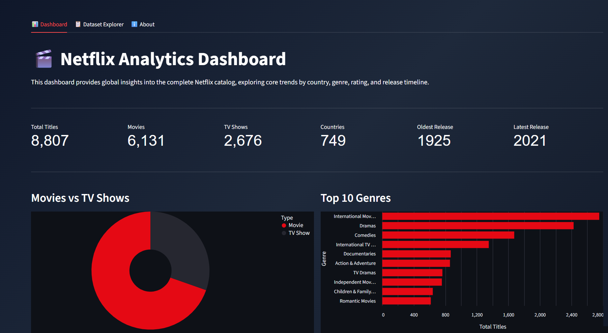
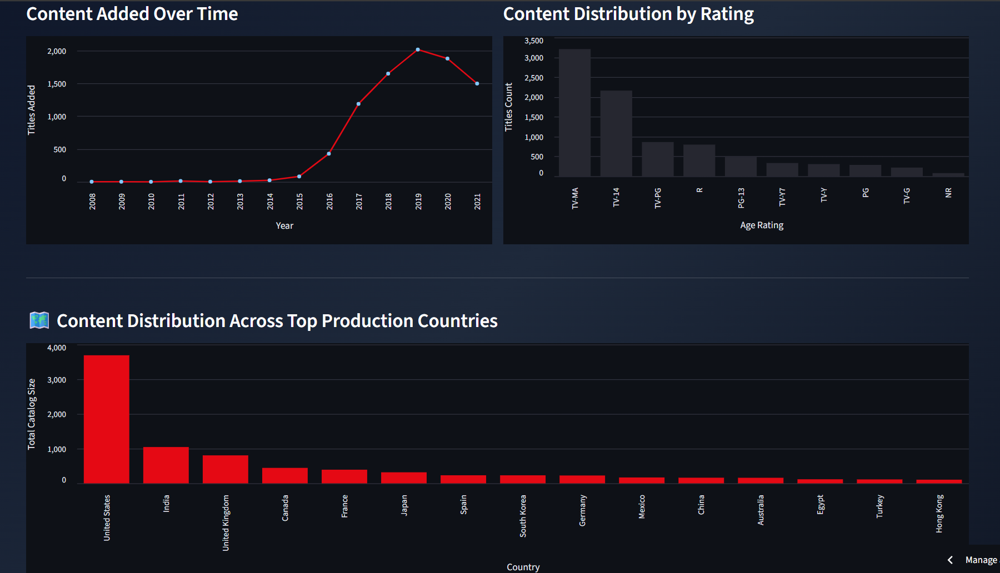
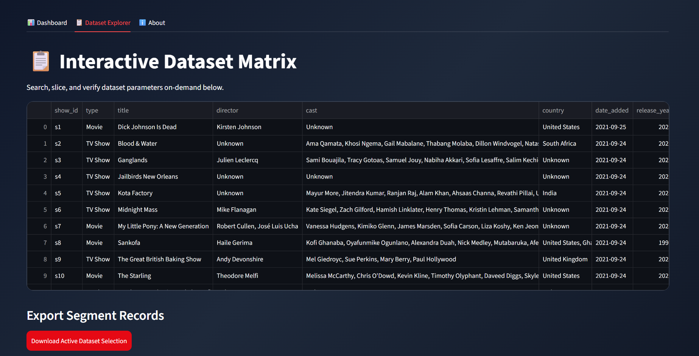
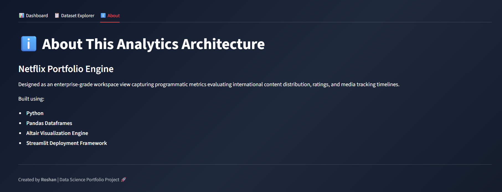

# 🎬 Netflix Analytics Dashboard

An interactive **Netflix Analytics Dashboard** built using **Python, Pandas, Plotly, and Streamlit**. This project analyzes the Netflix Movies & TV Shows dataset to uncover insights about content distribution, genres, countries, ratings, and release trends through an interactive web application.

---

## 🚀 Live Demo

🔗 **Live Application:** https://netflixinsights.streamlit.app/

---

## 📸 Dashboard Preview

### Home Page




### Dataset Explorer



### About



---

# 📖 Project Overview

Netflix hosts thousands of movies and TV shows from around the world. This project explores the Netflix catalog using Exploratory Data Analysis (EDA) and presents the findings through an interactive Streamlit dashboard.

The project demonstrates a complete data analytics workflow including:

- Data Cleaning
- Data Preprocessing
- Exploratory Data Analysis (EDA)
- Interactive Data Visualization
- Dashboard Development
- Deployment using Streamlit

---

# ✨ Features

- 📊 Interactive Dashboard
- 🎬 Movies vs TV Shows Analysis
- 🌍 Country-wise Content Analysis
- 🎭 Genre Distribution
- ⭐ Rating Distribution
- 📅 Release Year Trends
- 📈 Content Added Over Time
- 🌎 Interactive World Map
- 🔍 Search Movies & TV Shows
- 📥 Download Filtered Dataset
- 📋 Interactive Data Table

---

# 🛠️ Technologies Used

| Technology | Purpose |
|------------|---------|
| Python | Programming Language |
| Pandas | Data Cleaning & Analysis |
| NumPy | Numerical Operations |
| Matplotlib | Interactive Visualizations |
| Streamlit | Dashboard Development |
| Jupyter Notebook | Exploratory Data Analysis |
| Git | Feature Engineering |
| GitHub | Project Hosting |

---

# 📂 Project Structure

```text
Netflix-Analytics-Dashboard/
│
├── app/
│   └── app.py
├── data/
│   ├── netflix_titles.csv
│   └── netflix_titles_updated.csv
│
├── notebooks/
│   └── netflix_analysis.ipynb
│
├── images/
|   |── N.webp
│   ├── Content over time.png
│   ├── Countries.png
│   ├── Movies vs tv show.png
│   ├──Rating.png
|   └──Top 10 genres.png
│
├── requirements.txt
├── README.md
└── .gitignore
```

---

# 📊 Exploratory Data Analysis

The following analyses were performed:

- Dataset Overview
- Missing Value Analysis
- Duplicate Record Removal
- Movies vs TV Shows Distribution
- Country-wise Content Analysis
- Genre Distribution
- Rating Analysis
- Release Year Analysis
- Content Added Over Time
- Top Directors Analysis
- Movie Duration Distribution
- Dashboard Development

---

# 📈 Key Insights

Some important insights obtained from the dataset include:

- Movies account for a larger share of Netflix's catalog than TV Shows.
- The United States contributes the highest number of Netflix titles.
- Drama and International Movies are among the most common genres.
- Netflix experienced rapid content growth during the late 2010s.
- TV-MA is one of the most frequently assigned content ratings.
- The catalog includes content from many countries, reflecting Netflix's global reach.

---

# 🌍 Dashboard Features

The Streamlit dashboard allows users to:

- Filter content by Type
- Filter by Country
- Filter by Rating
- Filter by Release Year
- Search any Movie or TV Show
- Explore Interactive Charts
- View Global Content Distribution
- Download Filtered Data

---

# 📁 Dataset

**Dataset Name:** Netflix Movies and TV Shows

### Dataset includes:

- Show ID
- Type
- Title
- Director
- Cast
- Country
- Date Added
- Release Year
- Rating
- Duration
- Genre
- Description

---

# ⚙️ Installation

## Clone Repository

```bash
git clone https://github.com/roshankshah2005-creator/NETFLIX_ANALYTICS_DASHBOARD.git
```

## Move into Project Folder

```bash
cd Netflix-Analytics-Dashboard
```

## Create Virtual Environment

```bash
python -m venv .venv
```

## Activate Virtual Environment

### Windows

```bash
.venv\Scripts\activate
```

## Install Dependencies

```bash
pip install -r requirements.txt
```

## Run the Application

```bash
streamlit run app/app.py
```

---

# 📷 Sample Visualizations

The dashboard includes:

- Pie Chart
- Bar Chart
- Horizontal Bar Chart
- Line Chart
- Area Chart
- Choropleth World Map
- Interactive Data Table

---

# 🎯 Skills Demonstrated

This project demonstrates practical experience in:

- Python Programming
- Data Cleaning
- Data Preprocessing
- Exploratory Data Analysis
- Feature Engineering
- Interactive Data Visualization
- Dashboard Development
- Git & GitHub
- Streamlit Deployment

---

# 💡 Future Improvements

Future enhancements may include:

- Movie Recommendation System
- Actor Network Analysis
- Dark/Light Theme 
- User Authentication
- Advanced Dashboard Filters
- AI-powered Movie Search
- Integration with Live Movie APIs
---

# 📌 Learning Outcomes

Through this project, I gained hands-on experience with:

- Working with real-world datasets
- Cleaning and preprocessing data
- Creating meaningful visualizations
- Building interactive dashboards
- Organizing professional data science projects
- Deploying applications using Streamlit
- Managing projects using Git and GitHub
---

# 👨‍💻 Author
**Roshan Kumar Sah**

Chemical Engineering Undergraduate

Aspiring Data Scientist | Machine Learning Enthusiast

---

## ⭐ If you found this project useful, please consider giving it a Star on GitHub!
